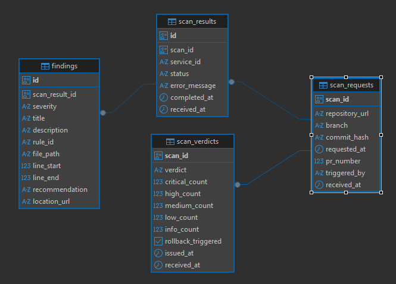

# Cerberus Database Model

## Overview

Este directorio contiene el modelo de datos OLTP del proyecto **Cerberus ML**, diseñado para almacenar la información generada durante el proceso de análisis de seguridad de repositorios.

El modelo implementa el contrato de datos definido por los servicios de SecurityGate y permite persistir:

* Solicitudes de escaneo.
* Resultados individuales de los servicios analizadores.
* Hallazgos detectados.
* Veredictos finales emitidos por SecurityGate.

El esquema está normalizado y preparado para servir posteriormente como fuente de datos del servicio de Analytics/ML.

---

# Arquitectura

Todas las tablas pertenecen al esquema PostgreSQL:

```text
cerberus
```

Modelo de relaciones:

```text
scan_requests
      │
      │ 1:N
      ▼
scan_results
      │
      │ 1:N
      ▼
findings

scan_requests
      │
      │ 1:1
      ▼
scan_verdicts

users
  │
  ├──── 1:N ────► user_repositories
  ├──── 1:N ────► scan_requests   (user_id, opcional — quién disparó/es dueño del escaneo)
  └──── 1:N ────► audit_log
```

---

# Diagrama Entidad-Relación

El modelo puede visualizarse en:

```text
database/diagrams/cerberus_er_oltp_diagram.png
```

o desde este README:

```markdown

```

---

# Migraciones

Las migraciones deben ejecutarse en el siguiente orden:

| Orden          | Archivo                      | Descripción                                            |
| -------------- | ---------------------------- | ------------------------------------------------------ |
| 001            | 001_create_scans.sql         | Creación del esquema y tabla de solicitudes de escaneo |
| 002            | 002_create_scan_services.sql | Resultados de cada servicio analizador                 |
| 003            | 003_create_findings.sql      | Hallazgos individuales                                 |
| 004            | 004_create_verdicts.sql      | Veredicto consolidado                                  |
| 005            | 005_create_users_and_audit.sql | Autenticación interna, repositorios favoritos y auditoría |
| 006 *(futuro)* | analytics                    | Persistencia del pipeline ML                           |

---

# Diccionario de datos

---

## 1. scan_requests

Representa cada solicitud de escaneo emitida por SecurityGate.

Existe una fila por cada ejecución de análisis.

### Clave primaria

* `scan_id`

### Campos

| Campo          | Tipo         | Descripción                                |
| -------------- | ------------ | ------------------------------------------ |
| scan_id        | UUID         | Identificador único del escaneo            |
| repository_url | TEXT         | Repositorio GitHub analizado               |
| branch         | VARCHAR(255) | Rama analizada                             |
| commit_hash    | CHAR(40)     | Hash SHA-1 del commit                      |
| requested_at   | TIMESTAMPTZ  | Fecha de solicitud del escaneo             |
| pr_number      | INTEGER      | Número de Pull Request (opcional)          |
| triggered_by   | VARCHAR(100) | Usuario o sistema que disparó el análisis  |
| received_at    | TIMESTAMPTZ  | Momento en que Cerberus recibió el mensaje |

### Restricciones

* URL obligatoriamente perteneciente a GitHub.
* Branch no vacío.
* Commit SHA de 40 caracteres.
* PR mayor que cero.

### Índices

* idx_scan_requests_repository_url
* idx_scan_requests_requested_at

---

## 2. scan_results

Contiene el resultado generado por cada servicio analizador.

Un mismo escaneo puede producir múltiples resultados.

### Clave primaria

* `id`

### Clave foránea

* `scan_id → scan_requests.scan_id`

### Campos

| Campo         | Tipo         | Descripción                       |
| ------------- | ------------ | --------------------------------- |
| id            | UUID         | Identificador interno             |
| scan_id       | UUID         | Escaneo asociado                  |
| service_id    | VARCHAR(30)  | Servicio que produjo el resultado |
| status        | VARCHAR(10)  | Estado de ejecución               |
| error_message | VARCHAR(500) | Mensaje de error cuando aplica    |
| completed_at  | TIMESTAMPTZ  | Finalización del análisis         |
| received_at   | TIMESTAMPTZ  | Recepción del evento              |

### Valores permitidos

**service_id**

* vulnerability-service
* codequality-service

**status**

* success
* failed
* timeout

### Restricciones

* `error_message` solo existe cuando el estado es `failed` o `timeout`.
* Un mismo servicio no puede registrar dos resultados para el mismo escaneo (`UNIQUE(scan_id, service_id)`).

### Índices

* idx_scan_results_scan_id
* idx_scan_results_status

---

## 3. findings

Representa cada hallazgo individual detectado durante un análisis.

Cada registro pertenece a un único resultado de análisis.

### Clave primaria

* `id`

### Clave foránea

* `scan_result_id → scan_results.id`

### Campos

| Campo          | Tipo          | Descripción                      |
| -------------- | ------------- | -------------------------------- |
| id             | UUID          | Identificador del hallazgo       |
| scan_result_id | UUID          | Resultado al que pertenece       |
| severity       | VARCHAR(10)   | Nivel de severidad               |
| title          | VARCHAR(200)  | Título                           |
| description    | VARCHAR(2000) | Descripción                      |
| rule_id        | VARCHAR(100)  | Regla que originó el hallazgo    |
| file_path      | TEXT          | Archivo afectado (SAST)          |
| line_start     | INTEGER       | Línea inicial                    |
| line_end       | INTEGER       | Línea final                      |
| recommendation | VARCHAR(1000) | Recomendación                    |
| location_url   | TEXT          | URL afectada para hallazgos DAST |

### Valores permitidos

* critical
* high
* medium
* low
* info

### Restricciones

* line_end debe ser mayor o igual a line_start.
* Eliminación en cascada cuando desaparece un scan_result.

### Índices

* idx_findings_severity
* idx_findings_rule_id
* idx_findings_scan_result_id

---

## 4. scan_verdicts

Contiene el veredicto final consolidado emitido por SecurityGate para un escaneo.

Existe exactamente un registro por cada solicitud de escaneo.

### Clave primaria

* `scan_id`

### Clave foránea

* `scan_id → scan_requests.scan_id`

### Campos

| Campo              | Tipo        | Descripción                        |
| ------------------ | ----------- | ---------------------------------- |
| scan_id            | UUID        | Escaneo                            |
| verdict            | VARCHAR(10) | Resultado final                    |
| critical_count     | INTEGER     | Cantidad de hallazgos críticos     |
| high_count         | INTEGER     | Cantidad de hallazgos altos        |
| medium_count       | INTEGER     | Cantidad de hallazgos medios       |
| low_count          | INTEGER     | Cantidad de hallazgos bajos        |
| info_count         | INTEGER     | Cantidad de hallazgos informativos |
| rollback_triggered | BOOLEAN     | Indica si debe ejecutarse rollback |
| issued_at          | TIMESTAMPTZ | Fecha de emisión                   |
| received_at        | TIMESTAMPTZ | Fecha de recepción                 |

### Valores permitidos

* pass
* warning
* fail

### Restricciones

El veredicto debe ser consistente con los conteos de severidad.

Además:

* rollback solo puede activarse cuando el veredicto es **fail**.

### Índices

* idx_scan_verdicts_verdict
* idx_scan_verdicts_issued_at

---

## 5. users

Usuarios internos de Cerberus (autenticación propia, no delegada a un proveedor externo).

### Clave primaria

* `id`

### Campos

| Campo         | Tipo         | Descripción                                  |
| ------------- | ------------ | --------------------------------------------- |
| id            | UUID         | Identificador único del usuario                |
| email         | VARCHAR(255) | Email, único, usado para login                 |
| password_hash | VARCHAR(255) | Hash de la contraseña (nunca texto plano)      |
| role          | VARCHAR(20)  | `user` o `admin`                               |
| is_active     | BOOLEAN      | Si el usuario puede iniciar sesión             |
| created_at    | TIMESTAMPTZ  | Fecha de creación                              |
| last_login_at | TIMESTAMPTZ  | Último inicio de sesión (opcional)             |

### Restricciones

* `email` único.
* `role` limitado a `user` / `admin`.

### Índices

* Implícito por `UNIQUE` en `email`.

---

## 6. user_repositories

Repositorios de GitHub marcados como favoritos por cada usuario.

### Clave primaria

* `id`

### Clave foránea

* `user_id → users.id` (`ON DELETE CASCADE`)

### Campos

| Campo          | Tipo         | Descripción                          |
| -------------- | ------------ | ------------------------------------- |
| id             | UUID         | Identificador único                   |
| user_id        | UUID         | Usuario dueño del favorito             |
| github_url     | VARCHAR(512) | URL del repositorio GitHub             |
| default_branch | VARCHAR(255) | Rama por defecto a analizar            |
| created_at     | TIMESTAMPTZ  | Fecha en que se marcó como favorito    |

### Restricciones

* URL obligatoriamente perteneciente a GitHub.
* Un usuario no puede repetir el mismo `github_url` (`UNIQUE(user_id, github_url)`).

### Índices

* idx_user_repositories_user_id

---

## 7. audit_log

Registro de auditoría de acciones relevantes (creación de escaneos, login, administración de usuarios).

### Clave primaria

* `id`

### Clave foránea

* `user_id → users.id` (`ON DELETE SET NULL` — el log se conserva aunque se borre el usuario)

### Campos

| Campo      | Tipo         | Descripción                                          |
| ---------- | ------------ | ----------------------------------------------------- |
| id         | UUID         | Identificador único del evento                        |
| user_id    | UUID         | Usuario que originó la acción (opcional)               |
| action     | VARCHAR(100) | Tipo de acción, ej. `scan_created`, `login`, `user_suspended` |
| payload    | JSONB        | Datos adicionales del evento                           |
| created_at | TIMESTAMPTZ  | Fecha del evento                                        |

### Índices

* idx_audit_log_user_id
* idx_audit_log_action
* idx_audit_log_created_at

---

# Integridad referencial

El modelo implementa integridad mediante claves foráneas.

```text
scan_requests
    │
    ├──────────────► scan_results
    │                    │
    │                    ▼
    │                 findings
    │
    └──────────────► scan_verdicts

users
    ├──────────────► user_repositories
    ├──────────────► scan_requests.user_id (opcional)
    └──────────────► audit_log
```

La tabla **findings** utiliza:

```sql
ON DELETE CASCADE
```

para eliminar automáticamente los hallazgos cuando desaparece su resultado asociado.

La tabla **user_repositories** también usa `ON DELETE CASCADE` (se borran los favoritos si se borra el usuario).

La tabla **audit_log** usa `ON DELETE SET NULL` en `user_id` — el historial de auditoría se conserva aunque el usuario sea eliminado.

`scan_requests.user_id` no define `ON DELETE` explícito (por lo tanto es `RESTRICT`): no se puede borrar un usuario que tiene escaneos asociados, para preservar trazabilidad.

---

# Decisiones de diseño

## UUID

Todas las entidades principales utilizan UUID para facilitar integración distribuida y evitar colisiones entre servicios.

## Normalización

Los resultados y hallazgos se almacenan en tablas independientes evitando duplicidad de información.

## Auditoría

Cada tabla incorpora campos `received_at` para registrar el instante en que Cerberus recibió el evento desde RabbitMQ.

## Validaciones en base de datos

Las reglas del contrato se implementan mediante:

* CHECK
* UNIQUE
* FOREIGN KEY
* PRIMARY KEY

Esto permite garantizar consistencia incluso si existen múltiples consumidores de datos.

---

# Índices implementados

## scan_requests

* repository_url
* requested_at

## scan_results

* scan_id
* status

## findings

* severity
* rule_id
* scan_result_id

## scan_verdicts

* verdict
* issued_at

## users

* email (implícito por UNIQUE)

## user_repositories

* user_id

## audit_log

* user_id
* action
* created_at

---

# Compatibilidad con contratos

El esquema implementa los contratos publicados para:

* scan-request
* scan-result
* scan-verdict

Los cambios entre versiones se documentan en:

```text
database/SCHEMA_CHANGELOG.md
```

---

# Próxima evolución

La siguiente fase del proyecto incorporará el componente de Analytics.

Se añadirá una nueva migración para almacenar los resultados generados por el pipeline de Machine Learning (clustering y métricas), manteniendo separadas las responsabilidades del modelo OLTP y del procesamiento analítico.

> **Pendiente de seguimiento:** el diagrama ER (`diagrams/cerberus_er_oltp_diagram.png`)
> todavía no incluye `users`, `user_repositories` ni `audit_log`. Se recomienda
> regenerarlo en una próxima iteración.

---

# Estructura del directorio

```text
database/
├── README.md
├── SCHEMA_CHANGELOG.md
├── docker-compose.yml
├── diagrams/
│   └── cerberus_er_oltp_diagram.png
├── init/
│   ├── 001_create_scans.sql
│   ├── 002_create_scan_services.sql
│   ├── 003_create_findings.sql
│   ├── 004_create_verdicts.sql
│   └── 005_create_users_and_audit.sql
└── legacy/
    └── cerberus_schema_oltp_v1.sql
```